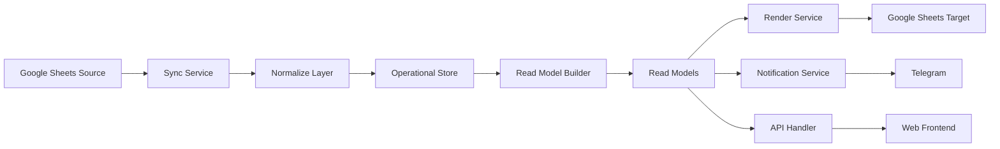

# Target Architecture (Sync -> Normalize -> Store -> Read Models -> Render/Notify -> API/Web)

## Goal
Move from tightly coupled runtime flow to layered architecture with explicit contracts and safe incremental migration (Strangler Pattern).

## High-Level Flow


## Runtime Boundaries
1. `core/*`: pure logic only, no IO.
2. `adapters/*`: all external integrations (Google/Telegram/LLM/store).
3. `services/*`: orchestration and use-case runtime flow.
4. `handlers/*`: entrypoints for cloud function/cli/web.

## Dependency Rules
1. `handlers -> services -> core`.
2. `services -> adapters` allowed.
3. `core -> adapters/services/handlers` forbidden.
4. `adapters` may depend on SDKs but not on handlers.
5. Read models are built from Operational Store, not from renderer internals.

## Target Module Layout
```text
src/
  core/
    models/
      contracts.py
    normalize/
      interface.py
      stage_parser.py
      date_inference.py
    rules/
      priorities.py
  adapters/
    google_sheets_reader.py
    google_sheets_renderer.py
    telegram.py
    llm_openai.py
    llm_google.py
    llm_yandex.py
    store_ydb.py
  services/
    sync/
      hash_gate.py
      sync_service.py
    readmodels/
      builder.py
    notify/
      notification_service.py
    render/
      render_service.py
  handlers/
    sync.py
    build_readmodels.py
    notify_morning.py
    render_sheets.py
    api.py
```

## Invariants
1. Sync runs only when `source_hash` changed.
2. Hash is computed only from source ranges (never from target render ranges).
3. Normalization keeps `raw_fields` for debugging and reproducibility.
4. Date inference for `dd.mm` stores `confidence` and `inference_rule`.
5. Notification delivery is idempotent per `(task_id, stage_idx, due_date, channel)`.
6. Renderer is consumer of read models; renderer does not own business truth.
7. API is read-only and based on read models.
8. Old entrypoints remain functional until each consumer is switched.

## Strangler Migration Pattern
1. Add new layer in parallel.
2. Validate parity on fixture/smoke checks.
3. Switch one consumer path.
4. Observe and rollback-fast if mismatch.
5. Decommission old path only after stable soak period.
