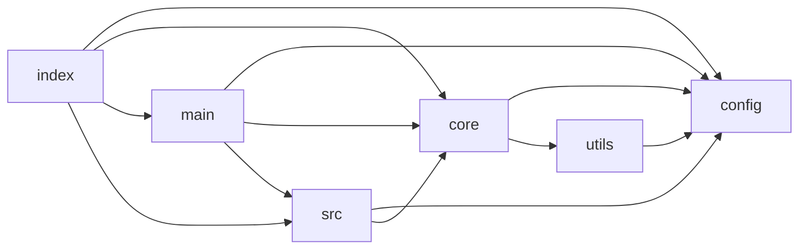
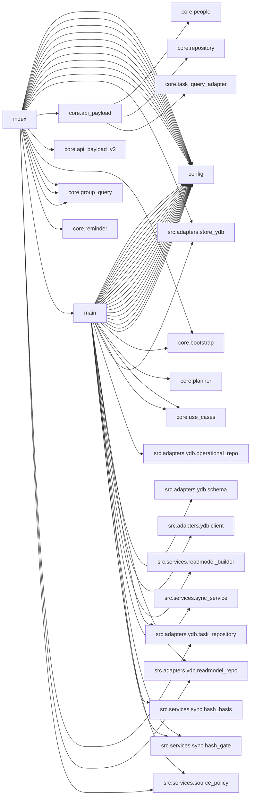

# CAM-CODE-AUDIT-V1 — Technical Audit Report

Repo snapshot: `DTM-main audit.zip` (extracted to analysis sandbox)  
Audit date: 2026-03-03 (UTC)

## Executive Summary

### What is in prod runtime path today
Current runtime is effectively built around:
- **Entrypoints:** `index.py` (Yandex Cloud HTTP+timer handler) and `main.py` (planner orchestration / timer job runner).
- **Domain core (current):** `core/*` (parsing + planner + reminder + task query contract).
- **Infra/adapters (mixed):**
  - `utils/service.py` + `utils/func.py` (Google Sheets IO + formatting helpers) — **used heavily by `core/*`**.
  - `src/adapters/ydb/*` + `src/services/*` (YDB operational/readmodel storage + sync + source-policy matrix).

The `src/*` tree contains a **second "clean" core (`src/core/*`) and handler/service skeletons**, but most of it is **not imported from entrypoints** (appears as in-progress / migration scaffolding).

### Primary architectural problems (highest impact)
1. **Two cores / split architecture:** `core/*` is the real domain, while `src/core/*` is mostly unused; tech adapters are split across `utils/*` and `src/adapters/*`.
2. **Entrypoints are doing too much:** `index.py` is an HTTP router + event-shape normalizer + dependency builder + use-case orchestrator; `main.py` is a large orchestration script mixing config, migrations, hashing gates, readmodel TTL, YDB wiring, and execution modes.
3. **Very large "god modules":** `core/reminder.py` (884 loc), `core/manager.py` (541 loc), `core/repository.py` (566 loc), `src/adapters/ydb/operational_repo.py` (760 loc), `utils/service.py` (531 loc).
4. **Legacy folder still present:** `old/*` contains prior versions of key modules and increases cognitive load; also some naming duplicates (`planner.py`, `manager.py`, `repository.py`, etc.).
5. **Duplicate sync service implementations:** `src/services/sync_service.py` (actual) vs `src/services/sync/sync_service.py` (skeleton) → ambiguity and risk of wrong import later.
6. **Config explosion:** `config/constants.py` defines many migration and runtime flags (39 env vars + 9 bool flags) which are directly pulled into entrypoints; hard to reason about defaults and which are obsolete.

## P01 — Module inventory and dependency map

### P01.T001 — Repository structure (top-level)
Top-level dirs of interest:
- `core/` — current domain core (namespace package).
- `src/` — new-structure scaffolding (handlers/services/adapters + core-v2).
- `utils/` — Google Sheets IO + formatting helpers (used by core).
- `config/` — env/constants.
- `agent/` — maintenance scripts and smoke tests (not in runtime path).
- `old/` — legacy copies of modules.
- `tests/` — unit tests.

Deliverable file: `module_inventory.csv` (attached separately).

### P01.T002 — Runtime reachable module set
Reachable (import graph) from `index` and `main`: **34 modules**.

Notable non-reachable but present (migration scaffolding, risk of bitrot):
- `src/adapters/__init__.py` (adapter, 3 loc) — Integration adapters boundary (external IO).
- `src/adapters/google_sheets_reader.py` (adapter, 3 loc) — Google Sheets source reader adapter boundary (placeholder).
- `src/adapters/google_sheets_renderer.py` (adapter, 3 loc) — Google Sheets target renderer adapter boundary (placeholder).
- `src/adapters/llm_google.py` (adapter, 3 loc) — Google LLM adapter boundary (placeholder).
- `src/adapters/llm_openai.py` (adapter, 3 loc) — OpenAI adapter boundary (placeholder).
- `src/adapters/llm_yandex.py` (adapter, 3 loc) — Yandex LLM adapter boundary (placeholder).
- `src/adapters/telegram.py` (adapter, 3 loc) — Telegram adapter boundary (placeholder).
- `src/adapters/ydb/__init__.py` (adapter, 15 loc) — YDB adapters for normalized operational data and readmodel snapshots.
- `src/core/__init__.py` (core-v2 (unused?), 3 loc) — Core domain layer (pure logic, no external IO).
- `src/core/models/__init__.py` (core-v2 (unused?), 3 loc) — Domain model contracts for migration path.
- `src/core/models/contracts.py` (core-v2 (unused?), 55 loc) — Domain data contracts for migration stages M1-M3.
- `src/core/normalize/__init__.py` (core-v2 (unused?), 3 loc) — Normalization primitives for raw -> normalized transformation.
- `src/core/normalize/date_inference.py` (core-v2 (unused?), 58 loc) — Date inference helpers (e.g. dd.mm without year).
- `src/core/normalize/interface.py` (core-v2 (unused?), 67 loc) — Primary normalization interface.
- `src/core/normalize/stage_parser.py` (core-v2 (unused?), 20 loc) — Stage cell parsing primitives.
- `src/core/rules/__init__.py` (core-v2 (unused?), 3 loc) — Domain rule helpers (prioritization/ordering/status derivation).
- `src/core/rules/priorities.py` (core-v2 (unused?), 19 loc) — Priority and ordering rules for normalized tasks.
- `src/handlers/__init__.py` (handler, 3 loc) — Runtime entrypoint handlers for new architecture path.
- `src/handlers/api.py` (handler, 12 loc) — API handler skeleton.
- `src/handlers/build_readmodels.py` (handler, 32 loc) — Read-model build handler.
- `src/handlers/notify_morning.py` (handler, 12 loc) — Morning notification handler skeleton.
- `src/handlers/render_sheets.py` (handler, 12 loc) — Render sheets handler skeleton.
- `src/handlers/sync.py` (handler, 39 loc) — Sync handler for migration path (M2/M3).
- `src/services/__init__.py` (service, 3 loc) — Service layer orchestration for migration path.
- `src/services/notify/__init__.py` (service, 3 loc) — Notification service modules.
- `src/services/notify/notification_service.py` (service, 15 loc) — Notification service skeleton.
- `src/services/readmodels/__init__.py` (service, 7 loc) — Read model builder modules.
- `src/services/readmodels/builder.py` (service, 75 loc) — Read-model builder primitives.
- `src/services/readmodels/publisher.py` (service, 17 loc) — Read-model publication helpers.
- `src/services/render/__init__.py` (service, 3 loc) — Render service modules.
- `src/services/render/render_service.py` (service, 15 loc) — Render service skeleton.
- `src/services/sync/__init__.py` (service, 16 loc) — Sync service modules.
- `src/services/sync/sync_service.py` (service, 44 loc) — Sync orchestration skeleton for migration stages M2-M3.

### P01.T003 — Dependency scheme

#### Package-level dependencies (reachable set)


#### Selected module-level dependencies (truncated)


## P02 — Hot spots and architectural smells

### P02.T001 — `index.py` audit (Yandex Cloud handler/router)
**Observed responsibilities mixed in one file:**
- HTTP event-shape normalization (`_extract_payload`, query parsing, body parsing, debug logging).
- Routing between run modes (timer/morning/test/sync-only/reminders-only) and HTTP endpoints.
- Building stores and repos (`build_operational_store`, `FrontendReadmodelRepo`, `YdbOperationalTaskRepository`).
- Calling planner orchestration (`main.main`) and/or directly building API payload (`core.api_payload*`).
- Telegram group query feature parsing and reply rendering (`core.group_query.*`).

**Concrete issues:**
- **Circular import risk:** `index.py` imports `main.main` while `main.py` imports many modules used by index. Changes in either can easily reintroduce cycles.
- **Configuration is scattered:** many settings imported at top and conditionals are spread across the handler flow.
- **Low testability:** key logic is embedded in handler functions with direct IO/building dependencies.
- **Multiple API versions in same file:** v1/v2 payload builders are imported and selected here.

**Recommendation (high priority):**
- Extract to `src/handlers/cloud_yc/` (or `src/app/yc/`) with:
  - `event_parser.py` (event-shape normalization).
  - `router.py` (route selection by path/mode/version).
  - `http_api_v1.py`, `http_api_v2.py` (thin endpoint handlers calling use-cases).
  - `timer_job.py` (timer entry).
- Keep `index.py` as a **10–30 loc shim** calling `router.handle(event, context)`.

### P02.T002 — `main.py` audit (entrypoint/cron/timer)
**Observed responsibilities mixed:**
- Run-mode resolution (`resolve_run_mode`) + orchestration.
- YDB bootstrap and migrations (`ensure_tables`, `YdbClient`, `YDB_MIGRATE_ON_START`).
- Multiple migration toggles (legacy write, dual write, source hash gate).
- Readmodel TTL logic, preflight top rows, full sync intervals.
- Direct printing of quality metrics and debug output.

**Concrete issues:**
- Hard to reason about "what runs when" without reading the whole file.
- Multiple layers collapsed: config + dependency wiring + use-case invocation + migration primitives.
- Many flags are **stage/migration artifacts** and should be confined to a `migrations/` or `features/` layer.

**Recommendation (high priority):**
- Extract `src/app/runtime/`:
  - `settings.py` (validated runtime settings object from env).
  - `wiring.py` (DI/constructors for repos/services).
  - `runner.py` (run-mode to use-case mapping).
- Keep `main.py` as shim that builds settings + calls `runner.run()`.

### P02.T003 — `core/` classification (business vs technical)
**Business/domain (should stay in domain layer):**
- `core/repository.py` (source parsing + timing parsing)
- `core/task_query_contract.py` / `core/task_query_adapter.py`
- `core/people.py`
- `core/errors.py`, `core/contracts.py`
- `core/group_query.py` (feature: Telegram group query)

**Application/orchestration (should become app/use-case layer):**
- `core/planner.py`
- `core/use_cases.py`
- Parts of `core/manager.py` (orchestration glue)

**Technical/infra leaking into core (should move behind adapters/services):**
- `core/sheet_renderer.py` (render adapter)
- `core/api_payload*.py` (presentation layer)
- `core/bootstrap.py` (DI wiring)
- Large parts of `core/reminder.py` that do provider selection, retry/backoff, Telegram IO, etc.

**Smell:** domain imports infra directly via `utils.service` (Google Sheets IO). This prevents clean separation and makes tests heavier.

### P02.T004 — Duplicate/legacy modules
Detected name duplicates with different contents:
- `main.py`: `main.py`, `old/main.py` (разные содержимое: 2 версии)
- `constants.py`: `config/constants.py`, `old/constants.py` (разные содержимое: 2 версии)
- `contracts.py`: `core/contracts.py`, `src/core/models/contracts.py` (разные содержимое: 2 версии)
- `manager.py`: `core/manager.py`, `old/manager.py` (разные содержимое: 2 версии)
- `planner.py`: `core/planner.py`, `old/planner.py` (разные содержимое: 2 версии)
- `repository.py`: `core/repository.py`, `old/repository.py` (разные содержимое: 2 версии)
- `func.py`: `old/func.py`, `utils/func.py` (разные содержимое: 2 версии)
- `service.py`: `old/service.py`, `utils/service.py` (разные содержимое: 2 версии)
- `sync_service.py`: `src/services/sync_service.py`, `src/services/sync/sync_service.py` (разные содержимое: 2 версии)

**Action:**
- Keep `old/` **out of import path** (already so if repo root is sys.path, `old.*` is still importable).
- Either delete `old/` or move to `archive/` outside runtime packaging; at minimum add guard to prevent accidental imports.

### P02.T005 — Global flags, singletons, ENV usage
`config/constants.py` defines:
- **39 string env vars** and **9 boolean flags**.
- Several migration toggles (`MIGRATION_*`, `LEGACY_*`, `WRITE_LEGACY_MILESTONES`, etc.) are consumed by entrypoints.

Concrete risks:
- Flags drift: old flags remain and are never removed → configuration becomes impossible to reason about.
- Defaults may differ between local and cloud because `.env` loading rules are embedded in constants.

**Recommendation:**
- Introduce `src/app/settings.py` with a validated settings dataclass/pydantic model.
- Categorize env vars:
  - Required (fail fast if missing in prod)
  - Optional with safe default
  - Deprecated (warn on use; remove after N releases)

## P02 — File-level hotspots (size & coupling)
Top 20 by size/coupling:
- `index.py` — 1132 loc — entrypoint — in=1 out=22
- `core/reminder.py` — 884 loc — core (current) — in=20 out=11
- `src/adapters/ydb/operational_repo.py` — 760 loc — adapter — in=8 out=2
- `old/manager.py` — 574 loc — legacy/old — in=0 out=6
- `core/repository.py` — 566 loc — core (current) — in=8 out=13
- `core/manager.py` — 541 loc — core (current) — in=11 out=10
- `utils/service.py` — 531 loc — shared-utils — in=12 out=4
- `main.py` — 489 loc — entrypoint — in=4 out=35
- `old/service.py` — 438 loc — legacy/old — in=0 out=5
- `src/adapters/store_ydb.py` — 418 loc — adapter — in=7 out=0
- `config/constants.py` — 358 loc — config — in=8 out=0
- `src/services/sync_service.py` — 350 loc — service — in=3 out=1
- `agent/reminder_alert_evaluator.py` — 317 loc — tooling/agent — in=11 out=0
- `agent/cloud_render_freshness_smoke.py` — 313 loc — tooling/agent — in=0 out=0
- `local_run.py` — 307 loc — entrypoint — in=3 out=8
- `old/repository.py` — 288 loc — legacy/old — in=0 out=6
- `core/task_query_contract.py` — 272 loc — core (current) — in=17 out=0
- `agent/deploy_api_gateway_domain.py` — 263 loc — tooling/agent — in=0 out=0
- `tests/services/test_sync_source_hash_gate.py` — 249 loc — test — in=0 out=2
- `core/api_payload_v2.py` — 230 loc — core (current) — in=5 out=6

## P03 — Target architecture (“как должно быть”)

### P03.T001 — Proposed package structure
Single runtime package, no split cores:

```
src/dtm/
  app/
    entrypoints/   # yc handler shim, local runner
    handlers/      # http, timer, cli
    wiring.py      # constructors / DI
    settings.py    # env -> Settings
  domain/
    tasks/         # task model, query contract, timing parsing
    people/
    errors/
  usecases/
    planner.py
    reminders.py   # orchestration only; no IO
    sync.py
  infra/
    sheets/        # google sheets reader/writer/render, formatting helpers
    telegram/
    llm/
    ydb/
  presentation/
    api_payload_v1.py
    api_payload_v2.py
```

### P03.T002 — Mapping (current → target) with rationale and risk
**Entrypoints**
- `index.py` → `src/dtm/app/entrypoints/yc.py` (shim) + `src/dtm/app/handlers/*` (logic).  
  Risk: medium (routing changes) — mitigate by golden tests on event samples.
- `main.py` → `src/dtm/app/entrypoints/cron.py` (shim) + `src/dtm/app/runner.py`.  
  Risk: low-medium — keep old API function signature for cloud.

**Core domain**
- `core/repository.py` → `src/dtm/domain/tasks/repository.py` (pure parsing + data).  
  Risk: medium (import paths) — mitigate with compatibility re-export module `core/repository.py` for 1–2 releases.
- `core/task_query_contract.py` → `src/dtm/domain/tasks/query_contract.py`.  
  Risk: low (mostly pure dataclasses).
- `core/people.py` → `src/dtm/domain/people/*.py`.  
  Risk: low.

**Infra**
- `utils/service.py` + `utils/func.py` → `src/dtm/infra/sheets/*`.  
  Risk: medium-high (called everywhere) — do as a dedicated campaign with staged refactor.

**Reminders**
- `core/reminder.py` split:
  - domain/policy (templates, message model) → `domain`
  - orchestration → `usecases/reminders.py`
  - IO clients (Telegram, LLM) → `infra/telegram`, `infra/llm`
  Risk: high (behavior-sensitive) — requires regression tests and fixture-based snapshot tests.

**YDB**
- `src/adapters/ydb/*` and `src/services/*` consolidate under `src/dtm/infra/ydb/*` and `src/dtm/usecases/sync.py`.  
  Risk: medium.

### P03.T003 — Refactor sequence (safe order)
1. **Introduce new package skeleton `src/dtm/*`** with no behavior changes; add re-export shims in old modules.
2. **Move pure contracts first**: task query contract, errors, row contracts. Update imports. Run tests.
3. **Extract entrypoint shims**: make `index.py`/`main.py` call new handler/runner but keep old signature and return shapes.
4. **Extract Google Sheets infra**: move `utils/*` into `infra/sheets`; keep `utils` as re-export wrappers temporarily.
5. **Split reminder pipeline**: isolate IO clients (Telegram/LLM) and keep orchestration stable behind interfaces.
6. **Remove legacy `old/` from importable path** (or delete) after all imports stabilized.
7. **Delete unused scaffolding (`src/core/*`, skeleton sync_service) OR wire it in** — pick one direction and enforce.

## P04 — Proposed execution campaigns (3–6)

### CAM-REF-ENTRYPOINTS (High benefit / Medium risk)
Charter: shrink `index.py` and `main.py` to shims; move routing/parsing/wiring into `src/dtm/app/*`.  
Deliverables: event-parser module, router module, runner module; golden tests for HTTP/timer events.

### CAM-REF-INFRA-SHEETS (High benefit / Medium-high risk)
Charter: move `utils/service.py` and formatting helpers behind `infra/sheets` interface; eliminate direct Sheets IO from domain.  
Deliverables: `SheetsGateway` interface, concrete Google implementation, updated core imports, performance regression checks.

### CAM-REF-REMINDER-SPLIT (High benefit / High risk)
Charter: split `core/reminder.py` into domain policies + orchestration + IO clients; reduce file size, isolate provider logic.  
Deliverables: stable reminder pipeline interface, snapshot tests for messages, idempotent send logic.

### CAM-CONSOLIDATE-YDB-SYNC (Medium benefit / Medium risk)
Charter: remove duplication between `src/services/sync_service.py` and `src/services/sync/*`; define a single sync orchestration API.  
Deliverables: one sync service, consistent naming, remove skeleton or integrate.

### CAM-DELETE-LEGACY-OLD (Medium benefit / Low risk)
Charter: archive/delete `old/*`, prevent accidental imports.  
Deliverables: `archive/` or deletion + CI check that forbids `import old`.

### CAM-CONFIG-HYGIENE (Medium benefit / Low-medium risk)
Charter: replace raw constants import spread with `Settings` object; mark deprecated flags; document required env vars.  
Deliverables: `settings.py`, env docs, runtime validation.

---

## Appendix A — Deliverables
- `module_inventory.csv` — full module list with sizes, categories, dependency degrees, and reachability.
